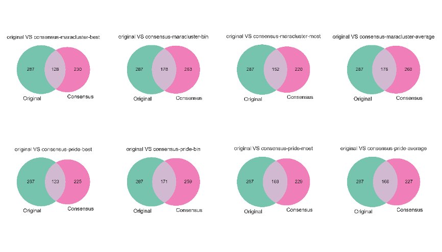
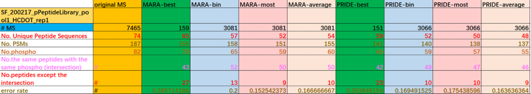
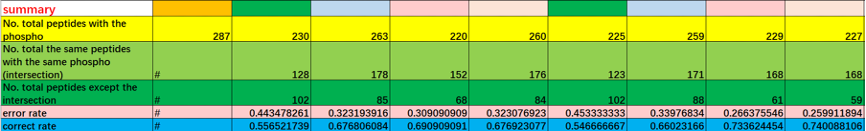

= Document
:toc:

== General Description of the project

The pipeline used to analyze the data can be found here (Figure 1), in summary:

* The original spectra of the datasets (PXD004732, PXD007058) using the MSGF+.
* The spectra is clustered using MaRa-Cluster and Spectra-Cluster (formally known as PRIDE cluster).
* For each cluster, a consensus spectra is generated using the following algorithms:
   ** Best spectrum
   ** Binning spectrum
   ** Average spectrum
   ** Most similar spectrum

image::pipeline-2021.png[]
: Current pipeline to analyze the data in the study.

== Dataset 1: PXD004732

From PRIDE dataset PXD004732 [PubMed: 28135259], 10 Raw files were used. In summary, this dataset was generated using the following sample protocol: Tryptic peptides were individually synthesized by solid phase synthesis, combined into pools of ~1,000 peptides and measured on an Orbitrap Fusion mass spectrometer. For each peptide pool, an inclusion list was generated to target peptides for fragmentation in further LC-MS experiments using five fragmentation methods (HCD, CID, ETD, EThCD, ETciD ) with ion trap or Orbitrap readout and HCD spectra were recorded at 6 different collision energies.

=== Results dataset PXD004732

|===
||Non-Clustered MS |MaRa-best|MARA-bin |MARA-most  |MARA-average |PRIDE-best |PRIDE-bin |PRIDE-most |PRIDE-average
10+|01650b_BA5-TUM_first_pool_75_01_01-3xHCD-1h-R2
|# MS/MS
|58583
|13154
|25744
|25744
|25744
|13040
|26347
|26347
|26347

|# Peptides
|3689
|1927
|2089
|**2120**
|2091
|1895
|2060
|**2064**
|2045

|# PSMs
|42592
|12064
|14527
|14491
|14496
|11812
|14486
|14431
|14464

10+|01650b_BF7-TUM_first_pool_96_01_01-3xHCD-1h-R2

|# MS/MS
|54848
|11536
|24782
|24782
|24782
|11338
|25343
|25345
|25345

|# Peptides
|2916
|1745
|1767
|**1791**
|1784
|1706
|1728
|**1729**
|1727

|# PSMs
|34991
|10043
|11896
|11886
|11896
|9727
|11710
|11705
|11723

|===

Note:: More details can be seen in the document https://github.com/ypriverol/specpride/blob/dev/results/identification-results-v4.3.xlsx[identification-results-4.3.xlsx]

In order to compare different algorithms we will discuss two metrics (number of Peptides and number of PSms identified ), in the Supplementary information we also have additional metrics like:

** Number of Unique Peptide Sequences
** Number of PSMs
** Number of Proteins
** The ratio of No.PSMs/No. MS

=== Some remarks and conclusions

* Non of the included combinations of cluster algorithm + consensus spectra generation methof performs better that searching for all the MS/MS spectra.

[NOTE]
====
**@jgriss** mentioned that most of the algorithms previously published already found this issue, we should probably found some citations to discussion and reference the original papers.
====

* The Most similar spectrum, consistently provides for all the RAw files the higher number of peptides. While the higher number of PSMs varies across files and methods between **Spectrum average** and **Spectrum bin**

[NOTE]
====
We really need to find a way to discuss this, I rally think that we don't observed major differences between methods in the number of PSMs, all then only have less 1% difference in the number of PSMs.
====

* In all cases, MaRa Cluster provides more Identifications and PSMs than PRIDE Cluster.

[NOTE]
====
As I mentioned in  https://github.com/statisticalbiotechnology/representative-spectra-benchmark/issues/56[this issue], I don't want to benchmark the results of clustering algorithms. I would like to focus the discussion about the consensus spectra generation methods. However, we can mentioned this. You can find more discussion about the starting clustering results in the https://github.com/ypriverol/specpride/blob/dev/results/supplement.docx[following document]
====

== Dataset 2: PXD007058

This figure demonstrates that distributions of identifying results with phosphorylation site from Original MS and Consensus MS.

1.	Excepting best method, the correct rate (including bin, most, average method) is over 67%. In PRIDE, the correct rate is higher. The correct rate in best mothed is approximately 55%.
2.	The gross of peptides identified is relatively small. Similarly, the MaxQuant results that downloading from PRIDE archive is also small

The description of columns:

* #MS : No. of total MS
* No. Unique Peptide Sequences: The No. of Unique Peptides
* No. PSMs: The No. of PSMs
* No. phospho: The total No. of peptides with phosphorylation site
* No. the same peptides with the same phospho (intersection): #
* No. peptides except the intersection: the No. of peptides except the intersection
* error rate: No. peptides except the intersection / No. phosphor
* correct rate: No. the same peptides with the same phospho (intersection) / No. phosphor
