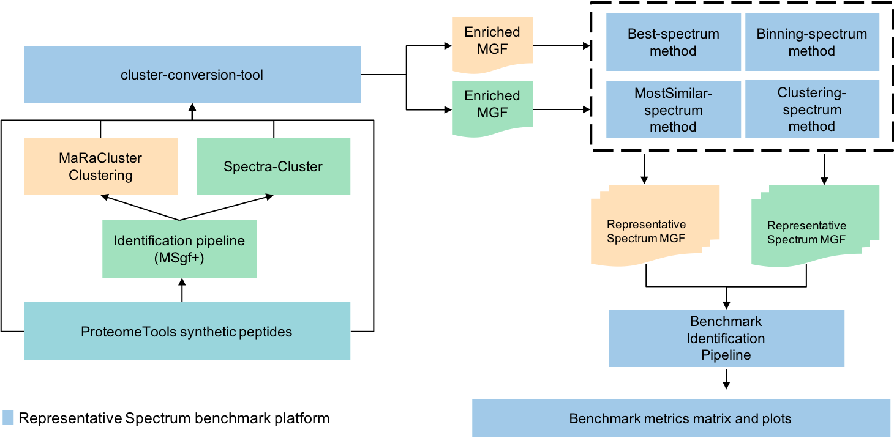
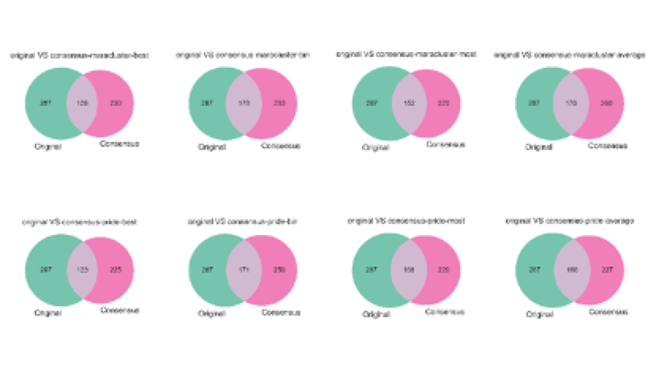
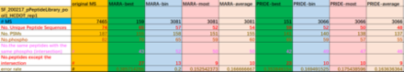
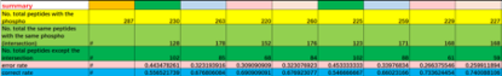

The pipeline used to analyze the data can be found here (Figure 1), in summary:

* The original spectra of the datasets (PXD004732, PXD007058) using the MSGF+.
* The spectra is clustered using MaRa-Cluster and Spectra-Cluster (formally known as PRIDE cluster).
* For each cluster, a consensus spectra is generated using the following algortihms:
   ** Best spectrum
   ** Binning spectrum
   ** Average spectrum
   ** Most similar spectrum

: Current pipeline to analyze the data in the study.

== Dataset 1: PXD004732

image::table1.png[]

Note:: More details can be seen in the document identification-results-4.3.xlsx

In order to compare different algorithms we follow this metrics:

* The description of columns.
** MS	The No. of total  MS
** Unique Peptide Sequences	The No. of Unique Peptides
** One-time Peptide sequences	The No. of Unique Peptides which only appears one time in PSMs
** Multi-times Peptide sequences	The No. of Unique Peptides which appears more than one times in PSMs
** PSMs	The No. of PSMs
** Proteins	The No. of referenced Proteins
** No.PSMs/No.MS	The ratio of No.PSMs/No. MS
** No.Unique Peptide/No.Unique Peptide of Original Identification	The ratio of Unique Peptide/ Unique Peptide in Original Identification One-time Peptide /Unique Peptide	The ratio of One-time Peptide /Unique Peptide

=== Some remarks:

* Why MARA-best and PRIDE-best has much less MS?: Because best method only prepares consensus spectrum for clusters which have identified MSs. So, Mara-clustering has (11218-4727) clusters which are unidentified; PRIDE-clustering has (9232-3755) clusters which are unidentified.

* How to understand the No. MS between two clustering methods?
** Mara-cluster has 11218 clusters at p10 level;(???clusters at p20 level)
** PRIDE-cluster has 9232 clusters at 0.99 threshold.

* What can we learn from this table?
** It looks like Mara-cluster has better identification Ratio on No.PSMs/No.MS:  0.844>0.819;
** It looks like Mara-cluster has better unique peptide identification ratio on No.Unique Peptide/No.Unique Peptide in Original Identification: 0.370>0.349;
** This trend also can be found at other RAW files too.

== Dataset 2: PXD007058

This figure demonstrates that distributions of identifying results with phosphorylation site from Original MS and Consensus MS.

1.	Excepting best method, the correct rate (including bin, most, average method) is over 67%. In PRIDE, the correct rate is higher. The correct rate in best mothed is approximately 55%.
2.	The gross of peptides identified is relatively small. Similarly, the MaxQuant results that downloading from PRIDE archive is also small

The description of columns:

* #MS : No. of total MS
* No. Unique Peptide Sequences: The No. of Unique Peptides
* No. PSMs: The No. of PSMs
* No. phospho: The total No. of peptides with phosphorylation site
* No. the same peptides with the same phospho (intersection): #
* No. peptides except the intersection: the No. of peptides except the intersection
* error rate: No. peptides except the intersection / No. phosphor
* correct rate: No. the same peptides with the same phospho (intersection) / No. phosphor
